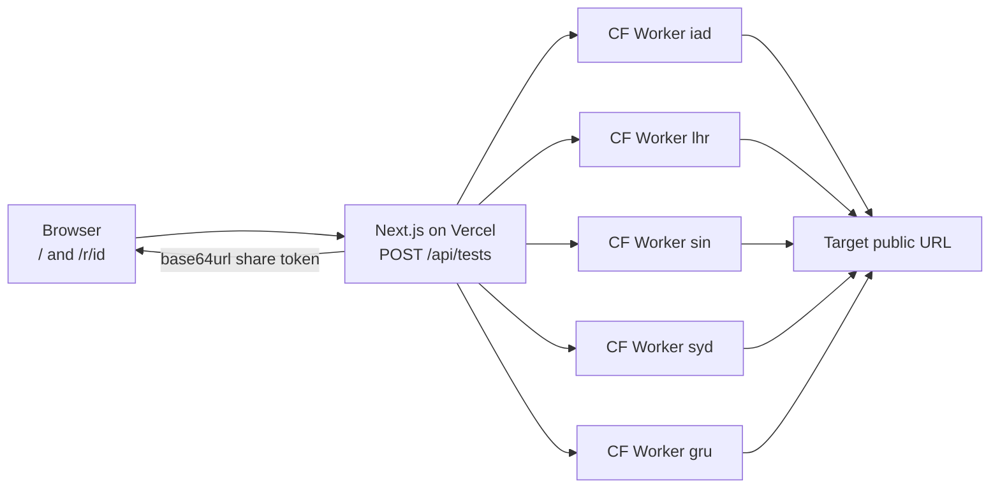
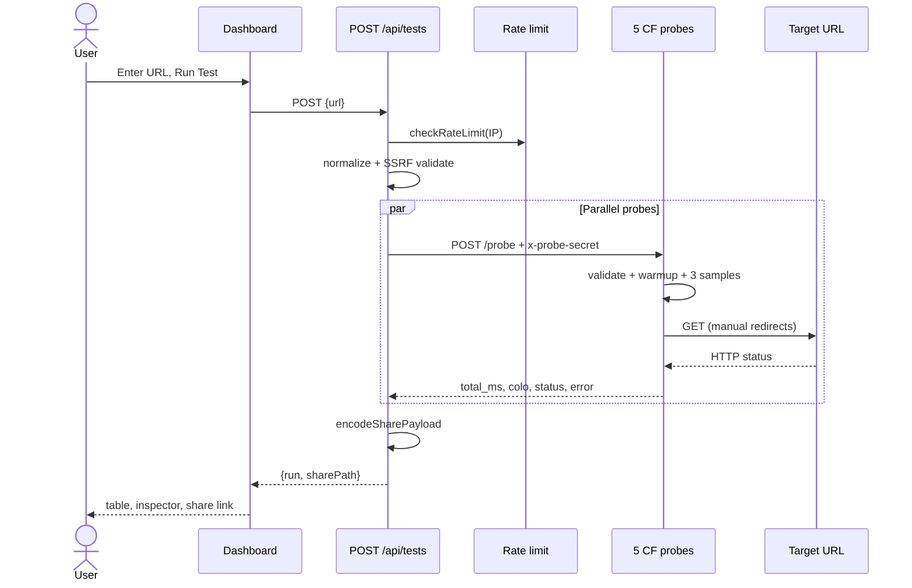
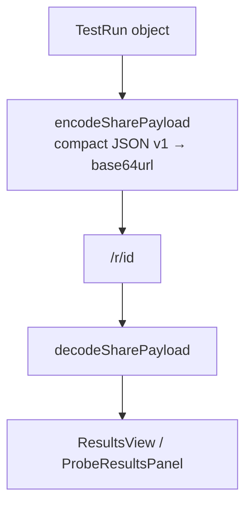

# LatencyMap — Project Overview

Single-context document for AI assistants, interview prep, and onboarding. Describes **what is implemented today** in this repository. When this file conflicts with older docs, trust the code paths listed in [Key source files](#key-source-files).

## What this is

**LatencyMap** is a portfolio MVP: a developer-tool dashboard that tests any public `http://` or `https://` URL from five real global regions in parallel, shows exact latency in a terminal-style UI, and produces a shareable result link — **with no database**.

**Live demo:** [latencymap-six.vercel.app](https://latencymap-six.vercel.app)

**Primary audience:** backend/API developers checking public endpoints.  
**Secondary:** founders and general users testing public websites.

## One-line summary

Paste a URL → Vercel Next.js API validates and rate-limits → five Cloudflare Worker probes measure GET latency in parallel → results return to the browser → full test run is encoded into `/r/[id]` as a base64url token.

---

## Implemented vs not built

### Implemented

- One-time manual latency tests for public HTTP/S URLs
- Five production probe regions on Cloudflare Workers
- Terminal-style dashboard: regional results table + selected-row inspector
- Share links that encode the full test run in the URL path
- SSRF protection on central API and every probe fetch path
- Anonymous rate limiting (in-memory per serverless instance)
- Vitest unit tests for core `lib/` behavior

### Not built (do not claim)

- User accounts, billing, teams, API keys
- Scheduled monitoring, alerts, or dashboards over time
- Database, Redis, KV, or server-side history
- Arbitrary HTTP methods or custom request headers
- Real TTFB / DNS / TLS / TCP timing breakdown
- 3D globe visualization (deferred; table is the evidence surface)
- Global distributed rate limiting
- Share-link expiry (tokens do not expire; decode failure only)
- Separate JSON decode API for share tokens (decode happens on `/r/[id]`)

---

## High-level architecture

```txt
Browser
  |
  v
Next.js app on Vercel
  /                  home dashboard
  /r/[id]            shareable result page (decodes token server-side)
  /api/tests         POST — run a test
  |
  +--> 5 x Cloudflare Worker probes (parallel POST /probe)
  |         |
  |         v
  |    target public URL (GET, SSRF-safe)
  |
  +--> share payload: base64url JSON in /r/[id] (no database)
```

### Mermaid — system architecture



### Stack

| Layer | Technology |
| --- | --- |
| Frontend + API | Next.js 15, React 19, TypeScript, App Router |
| Hosting | Vercel (`vercel.json`: Fluid Compute, `iad1`, function timeouts) |
| Probes (prod) | Cloudflare Workers + Wrangler (5 named environments) |
| Validation | Manual JSON body parse + custom URL safety + DNS |
| Tests | Vitest |
| Styling | Custom terminal CSS (`app/styles.css`) + Tailwind available |

---

## End-to-end workflow

### User request → result

1. User enters a public URL on `/` and submits the form.
2. Client hook `lib/use-latency-test.ts` sends `POST /api/tests` with `{ "url": "..." }`.
3. `app/api/tests/route.ts`:
   - Extracts client IP from `x-forwarded-for` or `x-real-ip`
   - Checks rate limit (`lib/rate-limit.ts`): **10 runs/hour/IP**, in-memory `Map` per instance
   - Parses body manually (`url` string, length 1–2048 chars)
   - Normalizes and validates URL (`lib/url-safety.ts`): scheme, credentials, localhost, private IPs, DNS resolution + blocklist
   - Calls `runRegionalTest()` (`lib/probes.ts`)
4. `runRegionalTest` fans out with `Promise.all` to configured probes:
   - **Production:** five Workers derived from `PROBE_WORKERS_SUBDOMAIN` + region ids in `lib/probe-regions.ts`
   - **Local/prod:** five Cloudflare Workers derived from `PROBE_WORKERS_SUBDOMAIN`
   - Each call: `POST` with `content-type: application/json`, header `x-probe-secret`, body `{ "url": "<normalized>" }`
   - Client timeout: 14s (`PROBE_CLIENT_TIMEOUT_MS` = probe 12s + 2s buffer)
5. Each Worker (`probes/cloudflare/src/worker.ts`):
   - Verifies `x-probe-secret` against `PROBE_SECRET`
   - Re-validates URL with DNS (DoH on Worker, Node DNS locally)
   - Runs `runProbeMeasurement()` from shared `lib/probe-fetch.ts`
6. Measurement algorithm (`lib/probe-fetch.ts`):
   - **Method:** GET only, `redirect: "manual"`, `cache: "no-store"`
   - **Redirects:** max 3; each redirect target re-validated
   - **Budget:** 12 seconds total per probe (`PROBE_FETCH_TIMEOUT_MS`)
   - **Warmups:** 3 untimed passes to stabilize connection reuse
   - **Samples:** 3 timed passes; need all 3 successful
   - **Reported value:** average of the **2 fastest** samples, rounded to nearest **10 ms**
   - **Response body:** cancelled after headers; not stored
7. Probe returns JSON: `region`, `placement_region`, `cloudflare_colo`, `total_ms`, `status_code`, `error`
8. API maps probe responses into `ProbeResult[]`, builds `TestRun` inline in the route handler (`lib/types.ts`), sets `id = encodeSharePayload(run)` (`lib/share-payload.ts`)
9. API responds `{ run, sharePath }` where `sharePath` is `/r/<token>`
10. UI renders `ProbeResultsPanel`: color-coded table + row inspector; user can copy share link
11. Share page `/r/[id]` decodes token server-side and renders `ResultsView` with the same panel

### Mermaid — request sequence



### Mermaid — share / data flow (no database)



There is **no database read or write**. Persistence is the URL token itself. Share tokens are decoded on the share page (`app/r/[id]/page.tsx`), not via a separate API route.

---

## API reference

### Central API (Next.js on Vercel)

| Route | Method | Purpose |
| --- | --- | --- |
| `/` | GET | Latency test dashboard |
| `/r/[id]` | GET | Shareable result page; `id` is base64url share token |
| `/api/tests` | POST | Run a test. Body: `{ "url": string }`. Returns `{ run, sharePath }` |

**`POST /api/tests` responses:**

| Status | Meaning |
| --- | --- |
| 200 | Success — `{ run: TestRun, sharePath: string }` |
| 400 | Invalid JSON, missing url, or URL failed validation |
| 429 | Rate limit exceeded (10/hour/IP) |
| 503 | Probe misconfiguration (`PROBE_SECRET` or `PROBE_WORKERS_SUBDOMAIN` missing in prod) |

**Note:** Invalid or malformed share tokens cause `/r/[id]` to 404. Tokens **do not expire**.

### Probe API (Cloudflare Workers)

| Route | Method | Auth | Purpose |
| --- | --- | --- | --- |
| `/probe` | POST | `x-probe-secret` header | Measure target URL latency |
| `/healthz` | GET | none | Liveness check |

**`POST /probe` input:**

```json
{ "url": "https://api.example.com" }
```

**`POST /probe` output:**

```json
{
  "region": "sin",
  "placement_region": "aws:ap-southeast-1",
  "cloudflare_colo": "SIN",
  "total_ms": 180,
  "status_code": 200,
  "error": null
}
```


---

## Data model

Defined in `lib/types.ts`.

### `ProbeResult`

| Field | Type | Notes |
| --- | --- | --- |
| `region` | string | Region id, e.g. `iad`, `sin` |
| `label` | string | Human label, e.g. `US East (Ashburn)` |
| `totalMs` | number \| null | Reported latency in ms; null on failure |
| `statusCode` | number \| null | HTTP status from target |
| `error` | string \| null | Error message if probe failed |
| `testedAt` | string | ISO timestamp when probe call started |
| `cloudflareColo` | string \| null | Actual CF data center (`request.cf.colo`) |
| `placementRegion` | string \| null | Placement hint from Wrangler config |

### `TestRun`

| Field | Type | Notes |
| --- | --- | --- |
| `id` | string | Base64url-encoded share token (same as `/r/[id]`) |
| `inputUrl` | string | Raw URL user typed |
| `normalizedUrl` | string | After normalization rules |
| `createdAt` | string | ISO timestamp when test completed |
| `results` | ProbeResult[] | One per configured probe region |

### Share payload encoding (`lib/share-payload.ts`)

- Wire format: versioned compact JSON (`v: 1`) with short field keys
- Encoded as **base64url** (no padding)
- Token is both the share link path segment and the `TestRun.id`
- No server-side storage; decoding is pure function of the token

### URL normalization rules

- Lowercase scheme and host
- Remove URL fragment (`#...`)
- Preserve path and query string
- Remove default ports (`:443` HTTPS, `:80` HTTP)
- Remove trailing slash **only** for root path (`https://x.com/` → `https://x.com`)

These are different URLs:

```txt
https://api.example.com/users
https://api.example.com/users?limit=10
https://api.example.com/health
```

---

## Probe regions (production)

Committed in `lib/probe-regions.ts`. Deployed via `probes/cloudflare/wrangler.jsonc`.

| ID | Label | Country | Placement hint |
| --- | --- | --- | --- |
| `iad` | US East (Ashburn) | United States | `aws:us-east-1` |
| `lhr` | Europe West (London) | United Kingdom | `aws:eu-west-2` |
| `sin` | Asia Southeast (Singapore) | Singapore | `aws:ap-southeast-1` |
| `syd` | Australia East (Sydney) | Australia | `aws:ap-southeast-2` |
| `gru` | South America (Sao Paulo) | Brazil | `aws:sa-east-1` |

**Production probe URL pattern:**

```txt
https://latencymap-probe-{regionId}.{PROBE_WORKERS_SUBDOMAIN}/probe
```

**Honesty rule:** `placement_region` is a Cloudflare placement **hint**, not a guarantee of city-level execution. `cloudflare_colo` is the honest execution location.

---

## UI behavior

- **First screen is the tool**, not a marketing page (`components/latency-dashboard.tsx`)
- Full-screen terminal shell with orange command accents (`app/styles.css`)
- Terminal boot sequence on first visit (skipped on repeat via `sessionStorage`)
- After test: regional results table in fixed probe order + selected-row inspector
- **Latency color contract** (`lib/latency-display.ts`):
  - green: `< 150 ms`
  - yellow: `150–300 ms`
  - red: `> 300 ms`
  - gray: failed
- Inspector shows: latency, status, region, colo, placement, tested-at
- Measurement note in UI: "each region: 3 checks, slowest ignored, rounded to 10 ms"
- Failed probes are visually distinct from slow probes

---

## Security and abuse protection

Applied on **both** the central API (`lib/url-safety.ts`) and probes (`lib/probe-url-safety.ts`):

- Allow only `http://` and `https://`
- Reject embedded credentials in URLs
- Block localhost, `.local`, `.internal` hostnames
- Block private/internal IPv4 and IPv6 ranges
- Block link-local and cloud metadata IPs (e.g. `169.254.169.254`)
- DNS-resolve hostnames and block if any resolved IP is private
- Re-validate every redirect target; cap at 3 redirects
- 12-second probe measurement budget
- Cancel response body after headers (no body storage)
- Cap probe request body size (16 KB on Worker)
- Rate limit: 10 test runs/hour/IP (in-memory, per serverless instance)
- Probe auth: shared `PROBE_SECRET` via `x-probe-secret` header (timing-safe compare)

---

## Deployment

### Environment variables

| Variable | Where | Required | Purpose |
| --- | --- | --- | --- |
| `PROBE_WORKERS_SUBDOMAIN` | Vercel | Yes (prod) | Workers subdomain, e.g. `acme.workers.dev` |
| `PROBE_SECRET` | Vercel + all Workers | Yes | Shared Worker authentication |
| `PROBE_HOST`, `PROBE_PORT` | Local | No | Local probe bind (default `127.0.0.1:8787`) |

### Deploy probes (Cloudflare)

```bash
npm run probe:cf:secrets:set          # set PROBE_SECRET on all envs
npm run probe:cf:deploy:regions       # deploy iad, lhr, sin, syd, gru
npm run probe:cf:print-env -- <subdomain>  # print Vercel env block
```

### Deploy app (Vercel)

Set `PROBE_WORKERS_SUBDOMAIN` and `PROBE_SECRET` in Vercel project settings, then deploy from GitHub or `npx vercel --prod`.

### Local development

```bash
npm install
npm run dev:local    # Next.js app (set PROBE_WORKERS_SUBDOMAIN + PROBE_SECRET for real tests)
```

Local app development calls the same five regional Workers as production when env vars are set.

---

## Key source files

| Path | Responsibility |
| --- | --- |
| `app/api/tests/route.ts` | Run test: rate limit, validate, fan-out, encode share |
| `app/r/[id]/page.tsx` | Share page (server-side decode) |
| `app/page.tsx` | Home dashboard |
| `components/latency-dashboard.tsx` | Boot UX, form, results shell |
| `components/probe-results-panel.tsx` | Table + inspector |
| `components/results-view.tsx` | Share page results + copy link |
| `lib/url-safety.ts` | Central API URL normalize + SSRF (Node DNS) |
| `lib/probe-url-safety.ts` | Probe-side URL validate + DNS |
| `lib/probes.ts` | Fan-out to probes, map responses |
| `lib/probe-response.ts` | Build/map probe wire JSON → `ProbeResult` |
| `lib/probe-fetch.ts` | Shared measurement algorithm |
| `lib/share-payload.ts` | Encode/decode share tokens |
| `lib/rate-limit.ts` | In-memory IP rate limiting |
| `lib/use-copy-share-link.ts` | Shared share-link copy behavior |
| `lib/probe-regions.ts` | Region metadata + endpoint derivation |
| `lib/latency-display.ts` | Colors, formatting, measurement note |
| `lib/types.ts` | Shared TypeScript types (`ProbeResult`, `TestRun`) |
| `probes/cloudflare/src/worker.ts` | Production regional probe |
| `probes/cloudflare/wrangler.jsonc` | Worker names, placement hints |
| `vercel.json` | Vercel function config |

---

## Design decisions and tradeoffs

| Decision | Why |
| --- | --- |
| No database | Zero ops cost; share links are portable and stateless |
| URL-encoded persistence | Simple; tradeoff is long URLs and no server-side history |
| Cloudflare Workers for probes | Cheap multi-region edge compute + colo metadata |
| Direct Vercel fan-out | No coordinator or database; Vercel calls five Workers in parallel |
| Provider-agnostic `POST /probe` contract | Probes could move off Cloudflare without rewriting the app |
| GET-only probes | Enough for latency evidence; smaller abuse surface |
| Multi-sample aggregation | Reduces jitter; drops one slow spike per region |
| In-memory rate limit | Simple MVP; not globally consistent across instances |
| Terminal table UI | Dense, honest, developer-tool feel; no fake globe heatmap |

---

## Related documentation

| File | Purpose |
| --- | --- |
| `README.md` | Setup, deploy commands, env vars |
| `docs/PORTFOLIO.md` | Interview pitch, demo script, VC framing |
| `MVP_PLAN.md` | Product scope and constraints |
| `CONTEXT.md` | Short agent context |
| `AGENTS.md` | Cursor agent instructions |
| `PRODUCT.md` | Product definition |
| `DESIGN.md` | Visual system (shipped terminal UI) |
| `public/docs/html/` | Plain-language HTML docs (served at `/docs/html/` when deployed) |

---

## Quick interview talking points

1. **Problem:** APIs feel fast locally; users are global.
2. **Solution:** One-click parallel probes from five real regions with honest colo metadata.
3. **Architecture:** Vercel orchestrates; Cloudflare Workers measure; no database.
4. **Security:** SSRF protection on every fetch path — required for a URL-fetch tool on the public internet.
5. **Honesty:** Show `cloudflare_colo`, not fake regional heatmaps; placement is a hint.
6. **Scope discipline:** No accounts, monitoring, or billing — deliberate MVP boundaries.
